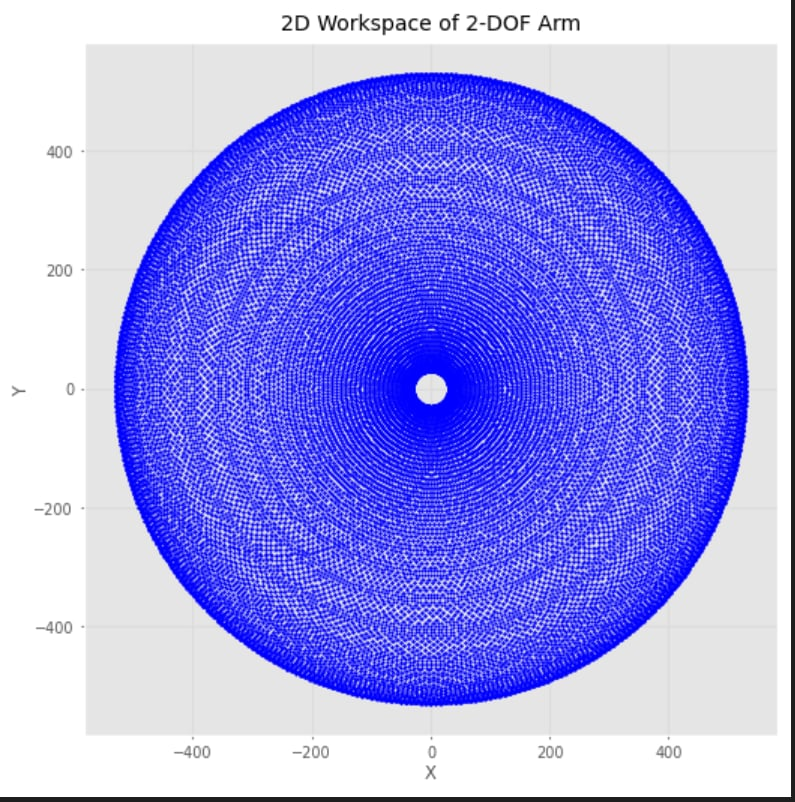
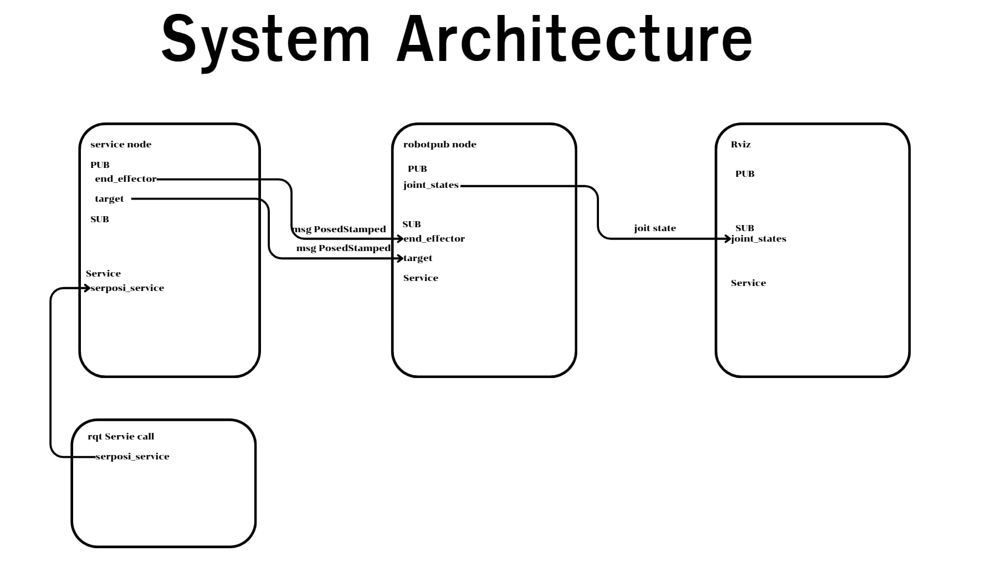
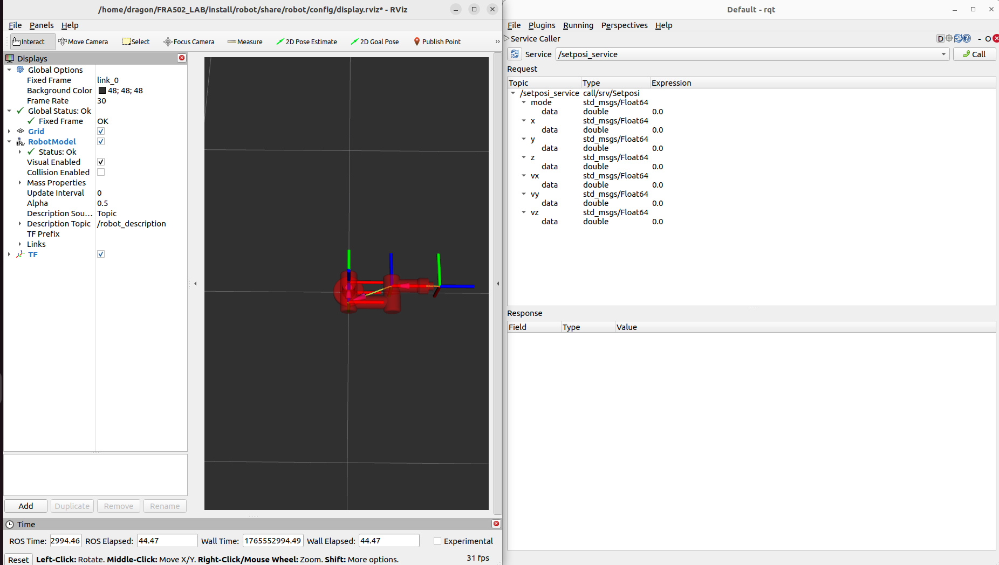

# FRA502_LAB
# wichan wichayanuparp 66340500051
# LAB 4 3DOF
## Work space

โดนในส่วนของ work space นั้นจะใามารถเกิดจะทำงานได้รอบมวงกลมถ้าเราดูจาก work space จาก side viwe ซึ่งจะไม่สามารถทำงานในส่วนที่อยู่ตรงกลางได้เนือกจาดแขนทั้งสอง link นั้นไม่เท่ากันเลยจะเหละตรงกลางไว้ที่ไม่สามารถทำงานได้โดยเมื่อรวมกับอีกแกมก็จะกลายเป็น work space ทรงกลมนั้นเอง 
## 🚀 SYSTEM ARCHITECTURE

## 🚀 ขั้นตอนการใช้งาน

### **ขั้นตอนที่ 1: โคลนโปรเจกต์จาก GitHub**

```bash
git clone -b LAB4 https://github.com/Wichanbright/FRA502_LAB.git
```


### **ขั้นตอนที่ 2: เข้าสู่ไดเร็กทอรีโปรเจกต์**
```bash
cd FRA502_LAB
````

### **ขั้นตอนที่ 3: Build (ทำครั้งเดียว)**

> Build เฉพาะครั้งแรก หรือเมื่อมีการแก้ไขโค้ด

```bash
colcon build
```

### **ขั้นตอนที่ 4: เปิด Terminal 2 อัน**

* Terminal 1 → รัน launch file (rviz)
* Terminal 2 → รัน robopub node
* Terminal 3 → รัน service node
* Terminal 4 → รัน rqt call service

---

### **ขั้นตอนที่ 5: รัน launch file (Terminal 1)**

ก่อนรันต้องสั่ง:

```bash
source install/setup.bash
```

จากนั้นรัน:

````bash
ros2 launch robot simple_display.launch.py 

````

### **ขั้นตอนที่ 6: รัน robopub node (Terminal 2)**

ก่อนรันต้องสั่ง:

```bash
source install/setup.bash
```

จากนั้นรัน:

```bash
ros2 run joint robopub.py
```
### **ขั้นตอนที่ 7: รัน service node (Terminal 3)**

ก่อนรันต้องสั่ง:

```bash
source install/setup.bash
```

จากนั้นรัน:

```bash
ros2 run joint service.py
```
### **ขั้นตอนที่ 8: รัน rqt call service (Terminal 4)**

ก่อนรันต้องสั่ง:

```bash
source install/setup.bash
```

จากนั้นรัน:

```bash
rqt
```
หลังจากนั้นก็จะเข้าไปที่ Service/setposi_service เพื่อที่จะทำการเข้าไปเลือกโหมดการใช้งาน
